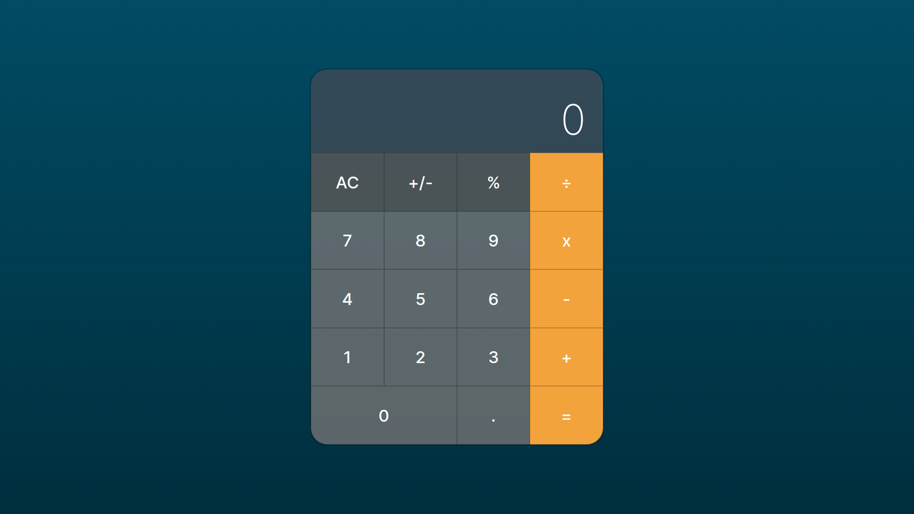

# Calculadora do macOS
Este é um projeto de uma calculadora inspirada na calculadora do macOS. Meu primeiro projeto pessoal feito com a intenção de exercita meus aprendizados em HTML, CSS e JavaScript, fiz o mais parecido possível da calculadora MacOs. Sei que poderia ter usado praticas melhores, mas tentei fazer apenas com os aprendizados que tenho até o momento e quero deixa registrado aqui para comporar com minhas melhoras no futuro, e estou muito feliz com o resultado.

# Como utilizar
Para utilizar a calculadora, basta abrir o arquivo index.html em qualquer navegador web e clicar nos botões numéricos e operadores para realizar as operações desejadas. Também é possível utilizar o teclado para inserir os números e operadores.

# Funcionalidades
A calculadora realiza as seguintes operações:

Adição (+);
Subtração (-);
Multiplicação (*);
Divisão (/);
Porcentagem (%);
Troca de sinal (+/-);
Todas teclas numericas do teclado funcioinam;
A tecla "%" realiza o calculo do mesmo;
A tecla Enter e Barra de espaço do teclado executam o calculo;
Além disso, a calculadora também possui a funcionalidade de apagar um caractere (backspace) e limpar todo o visor (clear).

